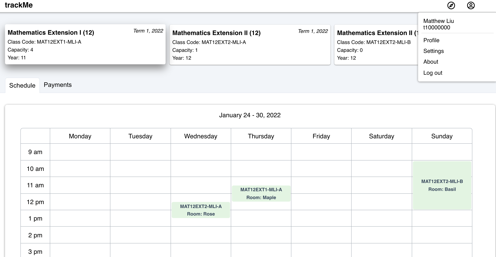

# trackMe (paused)

Demo of the trackMe Dashboard

### Motivation:

When I first started as a high school tutor at a small sized company, I found the experience of having to track my own hours and the work I have done to be really tedious. So, I came up with the idea for trackMe which aims to be an easy to use web application for improving employee experience. 

### Tech Stack

**Client Side:** ReactJS

- Axios
- Material UI
- Styled Components
- React Icons

**Server Side:** Python (Flask) & mySQL

**API:** 

- Firebase: user authentication & authorisation

### What Have I Learnt?

**Software Engineering:**

Coming straight into code without anything planned except for a few thoughts caused the process of figuring what to do and attempt to refactor really demotivating and stressful.

- More thoughtful planning via a design doc and diagrammatic sketches (Figma etc)
- Better use of project boards to keep track of progress

**React && JavaScript:**

Developed understanding of fundamental concepts

- React:
    - hooks (useState, useEffect, ...)
    - contexts (context provider, useContext, ...)
    - routing (useNavigate and public and private routes using react-router-dom)
    - managing http requests using axios and AbortController
    - rendering (JSX components, mounting, cleanups)
- JavaScript:
    - asynchronous programming ⇒ promises
    

**SQL:**

- Designing a database schema containing multiple tables, some of which connected via foreign keys
- Managing and modifying the database more efficiently using DataGrip
- Connecting mySQL to Python and making queries to fetch from the database and send to the client or update the database based on user input

### **Demo Account:**

Username: sdublrs@gmail.com

Password: password
